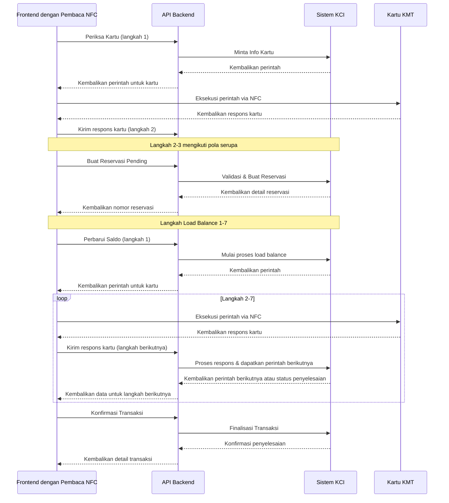
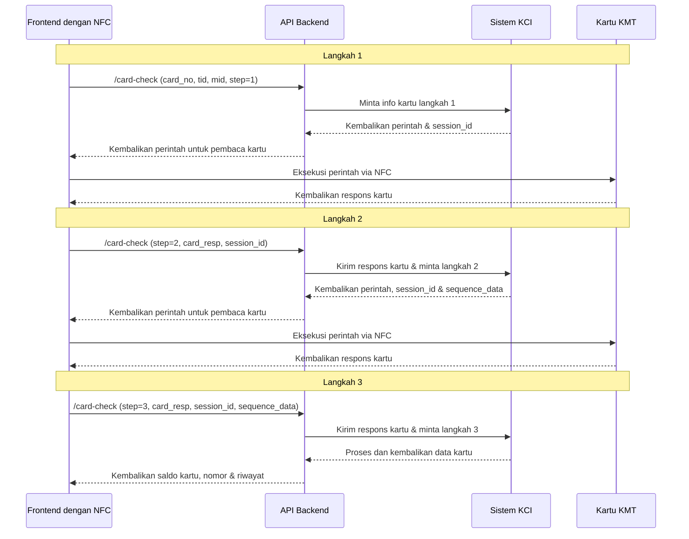
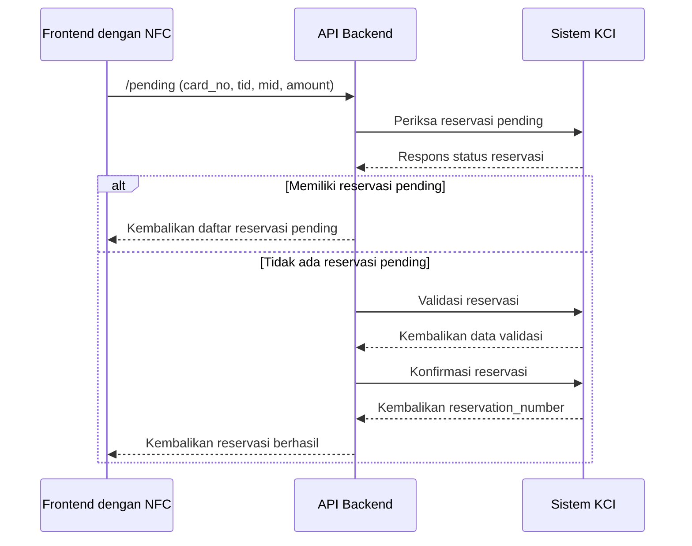
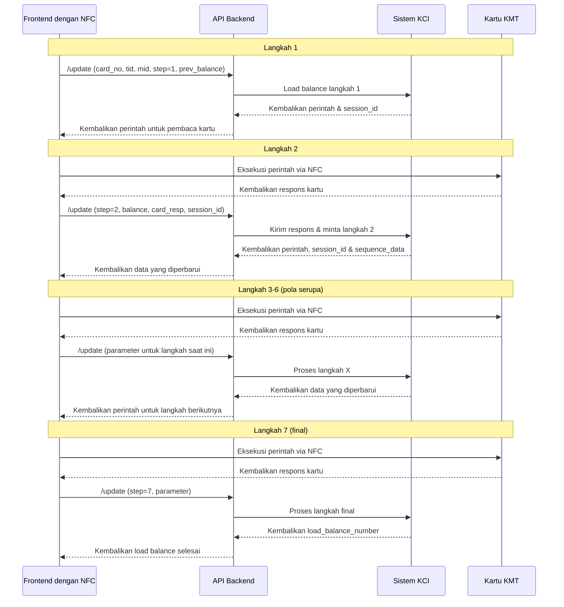
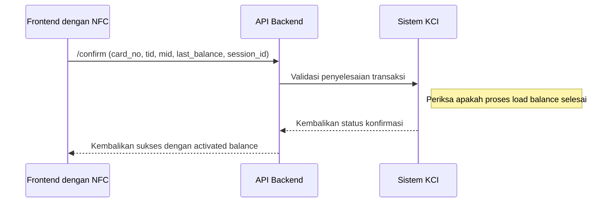

# Dokumentasi API Top-up Online KMT

## Gambaran Umum

Dokumen ini memberikan informasi tentang cara menggunakan endpoint REST API untuk top-up online kartu KMT (Kartu Multi Trip). API ini memfasilitasi proses pengisian saldo kartu KMT melalui integrasi backend dengan sistem KCI, memanfaatkan akses frontend ke pembaca kartu NFC.

## URL Dasar API

Semua permintaan API harus diawali dengan URL dasar API Anda yang diikuti dengan `/topup-kci`.

## Autentikasi

Semua permintaan memerlukan header autentikasi yang sesuai dengan kebijakan keamanan sistem Anda.

## Alur API dan Tanggung Jawab Frontend

Karena tim frontend memiliki akses langsung ke perangkat keras pembaca kartu NFC, integrasi mengikuti pola ini:

1. Backend menyediakan perintah yang akan dikirim ke kartu KMT
2. Frontend mengeksekusi perintah ini menggunakan pembaca NFC
3. Frontend menangkap respons kartu dan mengirimkannya kembali ke backend
4. Backend memproses respons dan memberikan langkah selanjutnya

Proses lengkap top-up KMT mengikuti urutan berikut:

1. **Periksa Kartu** - Memverifikasi kartu dan mendapatkan informasi kartu
2. **Buat Reservasi Pending** - Mereservasi jumlah top-up
3. **Perbarui Saldo** - Memproses top-up melalui beberapa langkah (1-7)
4. **Konfirmasi Transaksi** - Menyelesaikan proses top-up

### Alur Proses Keseluruhan



## Endpoint

### 1. Periksa Kartu (Informasi Kartu)

Digunakan untuk memverifikasi kartu dan mengambil informasi kartu. Ini adalah proses multi-langkah yang melibatkan komunikasi dengan kartu KMT fisik.

**Endpoint:** `POST /topup-kci/card-check`

#### Alur Periksa Kartu



#### Parameter Permintaan:

| Parameter | Tipe   | Wajib | Deskripsi                       |
|-----------|--------|---------|---------------------------------|
| card_no   | String | Ya     | Nomor kartu KMT 16 digit        |
| tid       | String | Ya     | ID Terminal                    |
| mid       | String | Ya     | ID Merchant                    |
| step      | Integer| Tidak   | Langkah proses (default: 1)     |

Untuk langkah 2-3, parameter tambahan diperlukan:

**Parameter Tambahan Langkah 2:**
- `card_resp` - Respons dari pembaca NFC setelah mengeksekusi perintah langkah 1
- `session_id` - ID Sesi dari respons langkah 1

**Parameter Tambahan Langkah 3:**
- `card_resp` - Respons dari pembaca NFC setelah mengeksekusi perintah langkah 2
- `session_id` - ID Sesi dari respons langkah 2
- `sequence_data` - Data urutan dari respons langkah 2

#### Respons:

```json
{
  "response": {
    "code": 200,
    "message": "Inquiry Done",
    "latency": 0.12345
  },
  "data": {
    "card_no": "5050505050505050",
    "account_status": "ACTIVE",
    "card_info_data": {
      "balance": "1863636",
      "card_number": "5050505050505050",
      "history": [...]
    },
    "step": 3,
    "next_step": null
  }
}
```

### 2. Reservasi Pending

Membuat reservasi untuk jumlah top-up. Langkah ini tidak memerlukan interaksi langsung dengan kartu KMT.

**Endpoint:** `POST /topup-kci/pending`

#### Alur Reservasi Pending



#### Parameter Permintaan:

| Parameter  | Tipe   | Wajib | Deskripsi                       |
|------------|--------|---------|---------------------------------|
| card_no    | String | Ya     | Nomor kartu KMT 16 digit        |
| tid        | String | Ya     | ID Terminal                    |
| mid        | String | Ya     | ID Merchant                    |
| amount     | Integer| Ya     | Jumlah top-up (dalam Rupiah)    |
| invoice_no | String | Tidak   | Nomor invoice (opsional)        |

#### Respons:

```json
{
  "response": {
    "code": 200,
    "message": "Pending Balance Success",
    "latency": 0.12345
  },
  "data": {
    "provider": "KCI-KMT",
    "amount": 10000,
    "card_no": "5050505050505050",
    "reff_no": "202505151234",
    "suspect_status": false,
    "paymentId1": "5050505050505050",
    "paymentId2": "123456789",
    "pending_balance": 10000,
    "trx_time": "2025-05-15 12:34:56",
    "reservation_number": "RBLP43250515000123"
  }
}
```

### 3. Perbarui Saldo

Memperbarui saldo kartu melalui proses multi-langkah yang memerlukan interaksi langsung dengan kartu KMT.

**Endpoint:** `POST /topup-kci/update`

#### Alur Perbarui Saldo



#### Parameter Permintaan:

**Parameter Dasar (Wajib untuk semua langkah):**
| Parameter | Tipe   | Wajib | Deskripsi                       |
|-----------|--------|---------|---------------------------------|
| card_no   | String | Ya     | Nomor kartu KMT 16 digit        |
| tid       | String | Ya     | ID Terminal                    |
| mid       | String | Ya     | ID Merchant                    |
| step      | Integer| Tidak   | Langkah proses (1-7, default: 1) |

**Parameter Khusus Langkah:**

- **Langkah 1:**
  - `prev_balance` - Saldo kartu sebelumnya

- **Langkah 2-7:**
  - `balance` - Saldo kartu saat ini
  - `card_resp` - Respons dari kartu KMT via pembaca NFC
  - `session_id` - ID Sesi dari langkah sebelumnya

- **Langkah 3-7:**
  - `sequence_data` - Data urutan dari langkah sebelumnya

#### Respons:

```json
{
  "response": {
    "code": 200,
    "message": "Update Balance Step X Success",
    "latency": 0.12345
  },
  "data": {
    "provider": "KCI-KMT",
    "step": 1,
    "next_step": 2,
    "data": {
      "command_len": 5,
      "command": "00ffff0100",
      "sequence_data": "",
      "session_id": "a98d9f858ee94378814d8db54b326121"
    },
    "amount": 10000,
    "card_no": "5050505050505050",
    "balance": 1863636,
    "reff_no": "202505151234"
  }
}
```

### 4. Konfirmasi Transaksi

Menyelesaikan proses top-up setelah pembaruan saldo berhasil.

**Endpoint:** `POST /topup-kci/confirm`

#### Alur Konfirmasi Transaksi



#### Parameter Permintaan:

| Parameter    | Tipe   | Wajib | Deskripsi                       |
|--------------|---------|---------|---------------------------------|
| card_no      | String  | Ya     | Nomor kartu KMT 16 digit        |
| tid          | String  | Ya     | ID Terminal                    |
| mid          | String  | Ya     | ID Merchant                    |
| last_balance | Integer | Ya     | Saldo kartu akhir              |
| session_id   | String  | Ya     | ID Sesi dari langkah update    |

#### Respons:

```json
{
  "response": {
    "code": 200,
    "message": "Confirm Topup Success",
    "latency": 0.12345
  },
  "data": {
    "provider": "KCI-KMT",
    "amount": 10000,
    "card_no": "5050505050505050",
    "last_balance": 1873636,
    "prev_balance": 1863636,
    "activated_balance": 10000,
    "reservation_number": "RBLP43250515000123",
    "load_balance_number": "LBLP43250515000456",
    "reff_no": "202505151234",
    "status": "SUCCESS"
  }
}
```

## Contoh Alur Lengkap

Berikut adalah contoh konkret keseluruhan proses dari perspektif frontend:

1. **Periksa Informasi Kartu**
   - Panggil `/topup-kci/card-check` dengan step=1
   - Terima perintah dalam respons
   - Eksekusi perintah ini pada kartu KMT menggunakan pembaca NFC
   - Tangkap respons kartu
   - Panggil `/topup-kci/card-check` dengan step=2, termasuk respons kartu
   - Terima perintah baru dalam respons
   - Eksekusi perintah ini pada kartu KMT
   - Tangkap respons kartu
   - Panggil `/topup-kci/card-check` dengan step=3, termasuk respons kartu
   - Terima saldo dan informasi kartu

2. **Buat Reservasi**
   - Panggil `/topup-kci/pending` dengan amount
   - Terima reservation_number dan reff_no

3. **Perbarui Saldo** (7 langkah)
   - Panggil `/topup-kci/update` dengan step=1, termasuk prev_balance
   - Terima perintah dalam respons
   - Untuk setiap langkah berikutnya (2-7):
     - Eksekusi perintah pada kartu KMT
     - Tangkap respons kartu
     - Panggil `/topup-kci/update` dengan nomor langkah berikutnya, termasuk respons kartu
     - Pada langkah 7, terima load_balance_number yang menandakan penyelesaian

4. **Konfirmasi Transaksi**
   - Panggil `/topup-kci/confirm` dengan saldo akhir
   - Transaksi selesai

## Penanganan Kesalahan

Setiap panggilan API mengembalikan kode respons dan pesan. Kode kesalahan umum:

- `200`: Sukses
- `400`: Permintaan buruk atau kesalahan validasi
- `412-445`: Berbagai kesalahan validasi (terminal, partner, batas kartu, dll.)
- `500`: Kesalahan server internal

Untuk setiap kesalahan, periksa pesan kesalahan dalam respons untuk detail tentang apa yang salah.

## Catatan Implementasi Frontend

Karena tim frontend memiliki akses penuh ke pembaca kartu NFC:

1. Implementasikan penanganan kesalahan yang tepat untuk kegagalan komunikasi NFC
2. Pastikan perintah dikirimkan dengan benar ke kartu dan respons ditangkap dengan tepat
3. Pertahankan status sesi sepanjang proses multi-langkah
4. Tampilkan indikator UI yang jelas tentang kemajuan melalui proses pembaruan 7 langkah
5. Tangani skenario timeout di mana kartu mungkin dilepas selama transaksi
6. Simpan session_id dan sequence_data antar langkah dengan cara yang aman
7. Pertimbangkan untuk mengimplementasikan mekanisme percobaan ulang untuk komunikasi NFC yang gagal

Proses komunikasi kartu KMT bergantung pada perintah NFC tingkat rendah yang dieksekusi dengan tepat, sehingga implementasi yang tepat dari antarmuka pembaca sangat penting untuk transaksi yang berhasil.
